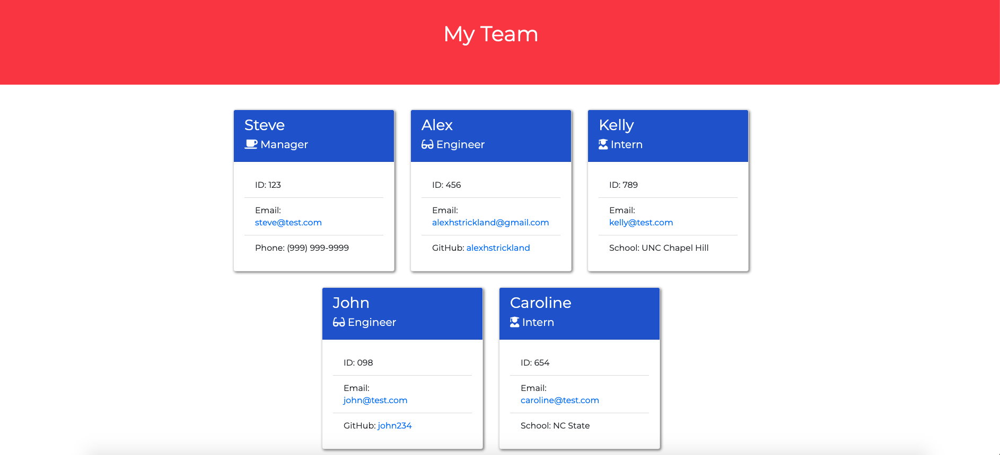

# Team_Profile_Generator

  [](https://opensource.org/licenses/ISC)

  ## Description
  This is a command-line application that takes in user input about employees on a software engineering team, then generates an HTML webpage displaying a card for each employee.

  ## Table of Contents

  * [Description](#Description)
  * [Installation](#Installation)
  * [Usage](#Usage)
  * [License](#License)
  * [Tests](#Tests)
  * [Questions](#Questions)
  * [Credits](#Credits)

  ## Installation

  To install necessary dependencies, please run the following command:
  ```
  npm install
  ```

  ## Usage
  This application requires node.js to start the application. Please enter the following to start:
  ```
  node index.js
  ``` 
  You will then be prompted to answer a series of questions about your team. When finished, your file will automatically be saved to the ./dist directory where you can access.  

  

  [Application Demo](https://drive.google.com/file/d/1eu2ZBF1AElmRSAgc9IBKltOakck65vBd/view)


  ## License
  This project is covered under the ISC license. Visit the following link for more information on this license: [ISC](https://opensource.org/licenses/ISC)

  ## Tests
  To test, please run the following command:
  ```
  npm run test
  ```

  ## Questions
  For any questions about the project, please contact me by either of the following links:
  
  * Email - alexhstrickland@gmail.com 
  
  or visit my GithHub profile
  
  * GitHub - [alexhstrickland](https://github.com/alexhstrickland)

